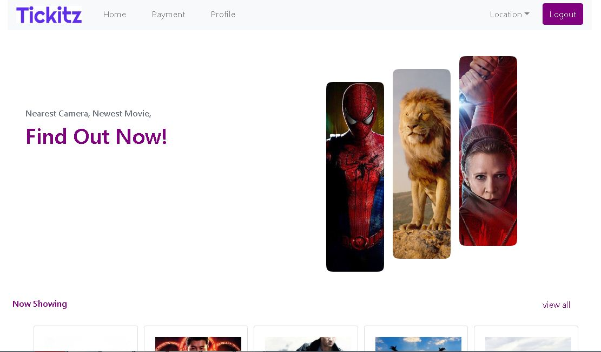

<h1 align='center'>React JS - Tickitz Booking Ticket</h1>
  <p align="center">
    <a href="link_deploy">View Demo</a>
    ·
    <a href="https://github.com/akbarsaladin36/xtickitz-indonesian-booking-website/issues">Report Bug</a>
    ·
    <a href="https://github.com/akbarsaladin36/xtickitz-indonesian-booking-website/pulls">Request Feature</a>
  </p>



## About The Project

Tickitz is the project website app that based on several booking ticket for movie in the world. This project is created to make people buy movie online ticket easier. 

## Built With

[](https://github.com/facebook/react)
[](https://github.com/react-bootstrap/react-bootstrap)

## Requirements

1. <a href="https://github.com/facebook/create-react-app">React JS</a>
2. Node_modules `npm install` or `yarn install`
3. Backend API Tickitz [`here`](https://github.com/akbarsaladin36/xtickitz-indonesian-booking-tickets-online-rest-api.git)

## Getting Started

1. Download this Project or you can type `git clone https://github.com/akbarsaladin36/xtickitz-indonesian-booking-website.git`
2. Open app's directory in CMD or Terminal
3. Type `npm install` or `yarn install`
4. Add .env file at root folder project

```sh
REACT_APP_BACKEND_BASEURL = [YOUR BACKEND API]
REACT_APP_IMAGE_URL = [YOUR BACKEND IMAGE API]
```

5. Type `npm start`

## Acknowledgements

- [Axios](https://www.npmjs.com/package/axios)
- [React](https://reactjs.org/)
- [React Bootstrap](https://react-bootstrap.github.io/)
- [Redux](https://github.com/reduxjs/react-redux)

## License

© [Muhammad Akbar Saladin Siregar](https://github.com/akbarsaladin36/)